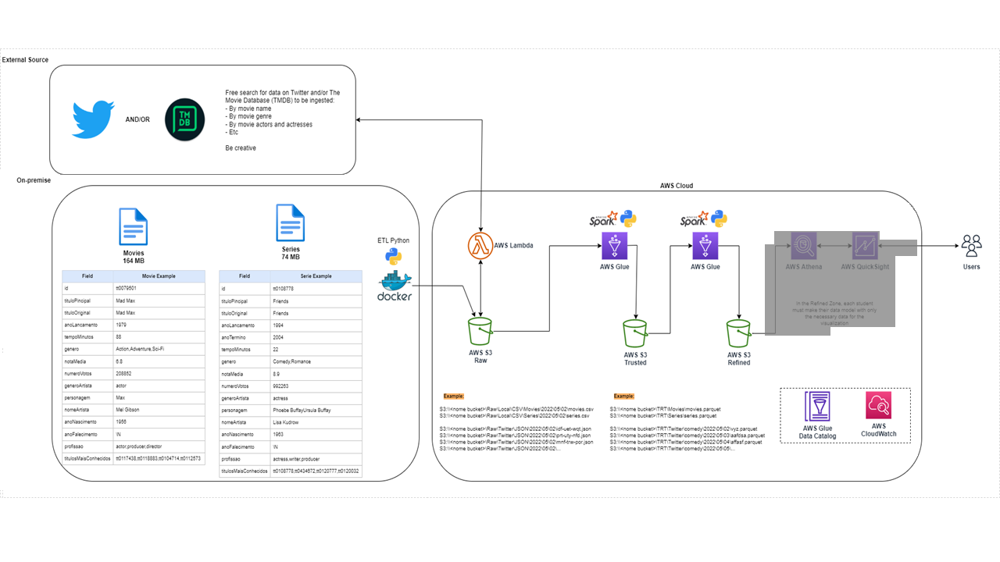
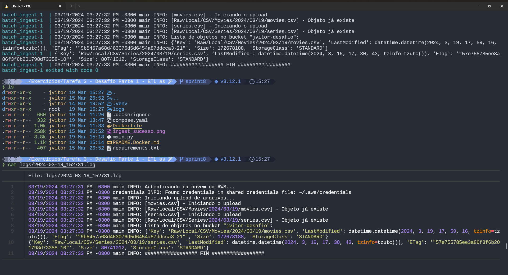

# !!!! Descrever todas as etapas do desafio aqui !!!!

Parte 1 - ETL

Parte 2 - Ingestão de dados do TMBD



Iniciar o aplicativo usando o compose:

```bash
docker compose --project-name desafio_upload_s3 up --build
```

Parar e remover o container:

```bash
docker compose -p desafio_upload_s3 down
```

## Informações gerais

Dentro de `requirements.txt` se encontram as libs que eu acreditei que seria interessante instalar junto à imagem do container. Entre elas:

- Pandas
- Numpy
- awscli
- boto3

O container monta no volume `/root/.aws/` a pasta onde ficam as credenciais de acesso ao AWS CLI da máquina host e a conexão com a AWS se dá com o `awscli` instalado pelo `pip`. Normalmente essa pasta se encontra em `$HOME/.aws` em sistemas Linux, mas esse caminho pode ser customizado no `compose.yaml`

O volume `/app/data` também deve ser montado como especificado no compose, e é onde os arquivos csv que serão enviados para o bucket se encontram.

Os logs de execução são salvos em `/app/logs` e são persistidos no host em uma pasta `logs` criada onde o compose for executado.

### Upload com sucesso


