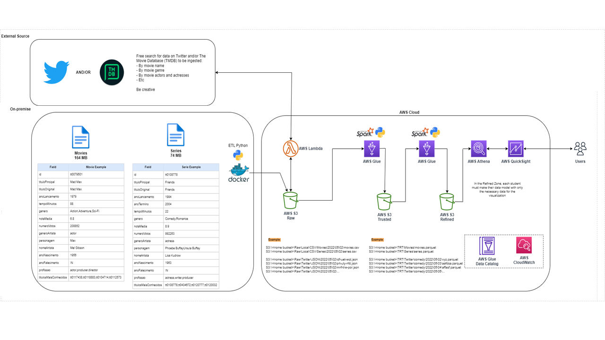

# ETL e Análise Histórica de Filmes de Sci-Fi e Fantasia

## 1. [Visão Geral do Projeto](https://www.youtube.com/watch?v=U8G73gXHvqo)



> [Parte 1 - Carregamento de Dados para o S3 via CLI](./Parte-1/)

1. Desenvolvimento de um script em **Python**, containerizado com **Docker**, para carregar arquivos CSV contendo dados históricos de filmes e séries para um bucket no Amazon S3.

> [Parte 2 - Ingestão de Dados de uma API](./Parte-2/)

1. Desenvolvimento de um programa para a ingestão de dados da **API** do **TMDB** (The Movie Database) com o objetivo de enriquecer os dados históricos.
1. Execução do código no **AWS Lambda** e armazenamento dos dados em JSON no S3.

> [Parte 3 - Tratamento e Modelagem dos Dados](./Parte-3/)

1. Limpeza, padronização e armazenamento dos dados brutos na camada **Trusted** utilizando o **AWS Glue** com **PySpark**.
1. Modelagem dimensional dos dados no [esquema estrela](https://learn.microsoft.com/pt-br/power-bi/guidance/star-schema) para otimizar consultas analíticas.
1. Carregamento dos dados na **Trusted** para a camada **Refined** de acordo com o modelo dimensional.
1. Execução de um crawler para catalogar os dados no **AWS Lake Formation**.

> [Parte 4 - Análise dos Dados](./Parte-4/)

1. Criação de uma **dashboard** utilizando o QuickSight.
1. Análise descritiva dos dados e extração de _insights_.

## 2. Carregamento de Dados em CSV para o Amazon S3

Na primeira etapa do desafio foi elaborado um [script em Python](./Parte-1/main.py) (containerizado com [Docker](https://docs.docker.com/get-started/overview/)), com o objetivo de carregar dados históricos oriundos da base de dados do IMDB em um **Bucket** no [AWS S3](https://aws.amazon.com/pt/s3/).

O container monta no volume `/root/.aws/` a pasta onde ficam as credenciais de acesso ao [AWS CLI](https://aws.amazon.com/pt/cli/) da máquina host e a conexão com a AWS se dá com o `awscli` instalado pelo `pip`. Normalmente essa pasta se encontra em `$HOME/.aws` em sistemas Linux, mas esse caminho pode ser customizado no `compose.yaml`.

O volume `/app/data` também deve ser montado como especificado no compose, e é onde os arquivos CSV que serão enviados para o bucket se encontram.

Os logs de execução são salvos em `/app/logs` e são persistidos no host em uma pasta `logs` criada de forma automática onde o compose for executado.


Os dados são salvos na camada Raw do **Bucket**, dentro de pastas contendo a data de upload dos arquivos, na forma `s3://<Bucket-name>/Raw/Local/CSV/Movies/YYYY/MM/DD/file-name.csv`.


## 3. Ingestão de Dados da API do TMDB

A segunda fase do projeto foi a ingestão de mais dados brutos através da **API** do [The Movie Database](https://developer.themoviedb.org/docs/getting-started), com o objetivo de complementar os dados carregados anteriormente.

### 3.1 Insights Esperados

Nessa etapa foi traçada uma visão geral dos insights esperados ao final da analise, possibilitando decidir quais dados deveriam ser extraídos da **API** e quais endpoints seriam requisitados.

1. **Relação entre Orçamento e Bilheteria**:

   - Analisar a relação entre o orçamento de produção e a bilheteria total de filmes de fantasia e ficção científica.
   - Identificar se existe uma correlação entre o investimento financeiro e o sucesso comercial desses filmes.

1. **Quantidade de Lançamentos ao Longo dos Anos**:

   - Determinar a quantidade de lançamentos de filmes de fantasia e ficção científica em cada ano.
   - Visualizar a tendência de lançamentos ao longo do tempo para entender padrões de produção dentro desses gêneros.
   - A hipótese principal é de que filmes que revolucionaram o gênero de ficção científica como **Metrópolis** e **Star Wars** levaram ao aumento na produção de filmes similares nos anos seguintes.

1. **Taxa de Recorrência de Atores**:

   - Investigar a presença de atores em filmes de fantasia e ficção científica.
   - Calcular a taxa de recorrência de cada ator para entender quais são os mais frequentemente escalados nesses filmes.

1. **Nota Média da Audiência**:

   - Calcular a nota média atribuída pela audiência a filmes de fantasia e ficção científica.
   - Comparar as médias de avaliação entre os dois gêneros e analisar possíveis diferenças de recepção pelo público.

1. **Cruzamento de Dados de Nota com Popularidade**:

   - Cruzar dados de nota média com métricas de popularidade para entender se filmes bem avaliados também são populares entre o público.

1. **Listar os 10 Mais Populares de Cada Gênero**:

   - Identificar e listar os 10 filmes mais populares de ficção científica e fantasia, considerando métricas como bilheteria, avaliações de usuários e classificações de popularidade.

### 3.2 Uso da API

O endpoint consultado foi o [movie-details](https://developer.themoviedb.org/reference/movie-details) `/movie/{movie_id}`, que extrai detalhes gerais sobre um filme de acordo com o ID requisitado.

Os IDs selecionados foram extraídos da base de dados [`movies.csv`](../Desafio-Final/data/Filmes+e+Series.zip) carregada anteriormente no S3. Foi feita também uma pré filtragem nesses IDs a fim de fazer as consultas apenas dos que continham os gêneros Sci-Fi ou Fantasia de acordo com o IMDB.

Dessa forma, foi possível fazer as requisições em apenas 14.303 dos 244.544 IDs distintos presentes no CSV original, diminuindo consideravelmente o tempo de execução com dados que não teriam utilidade.

Essa filtragem, assim como a utilização de funções assíncronas no [script](./Parte-2/Local-Testing/main.py), se provaram cruciais uma vez que, executando o programa no [AWS Lambda](https://aws.amazon.com/pt/lambda/), onde o limite de tempo de execução é de 15 minutos, o script teria ultrapassado com facilidade esse limite ao aumentar o número de consultas e/ou endpoints requisitados.

### 3.3 Dados Extraídos

A resposta de cada requisição ao `/movie/{movie_id}` continha diversos pares de chave-valor com informações que não eram necessárias para o tipo de análise a ser realizada. Assim, foi decidido que seria necessário filtrar apenas os campos importantes, que seriam de fato usados no futuro, usando um dict comprehension nas respostas:

```python
chaves_desejadas = [
        'id',
        'imdb_id',
        'title',
        'release_date',
        'vote_average',
        'vote_count',
        'popularity',
        'budget',
        'revenue',
        'runtime',
        'genres'
        ]
```

```python
registro = response.json()
registro_filtrado = {
      chave: registro[chave]
      if chave in registro else None
      for chave in chaves_desejadas}

tmdb_details.append(registro_filtrado)
```

Após o processamento das requisições à **API**, foram recuperados os dados de 12.875 filmes. Dos 14.303 IDs originais, 1.428 não foram encontrados na base de dados do TMDB. Assim, os IDs dos quais não foi possível extrair informações foram salvos em um arquivo `errors.csv`, enquanto que os detalhes extraídos com sucesso foram armazenados no S3, com uma cópia local de backup.


Os detalhes dos filmes foram salvos no formato JSON com a seguinte estrutura:

```json
{
  "id": 1895,
  "imdb_id": "tt0121766",
  "title": "Star Wars: Episode III - Revenge of the Sith",
  "release_date": "2005-05-17",
  "vote_average": 7.421,
  "vote_count": 13167,
  "popularity": 47.807,
  "budget": 113000000,
  "revenue": 850000000,
  "runtime": 140,
  "genres": [
    {
      "id": 12,
      "name": "Adventure"
    },
    {
      "id": 28,
      "name": "Action"
    },
    {
      "id": 878,
      "name": "Science Fiction"
    }
  ]
}
```

### 3.4 Execução no AWS Lambda

Após realizar diversos [testes locais](./Parte-2/Local-Testing/) de extração de dados, finalmente avançou-se para a etapa de execução do programa de forma _serverless_ na nuvem. Foi preciso [refatorar](./Parte-2/AWS-Lambda/lambda_function.py) alguns trechos do código para adaptar à leitura dos IDs no CSV salvo no S3 e também fazer o upload dos resultados dentro do mesmo Bucket.

A chave da API foi salva como uma variável de ambiente do Lambda e encriptada em repouso utilizando o [AWS KMS](https://aws.amazon.com/pt/kms/), só sendo desencriptada durante tempo de execução do script para poder fazer as chamadas à API.


Também foi necessário criar uma _layer_ com as dependências utilizadas no script para o Lambda (Pandas, NumPy, Requests).


Por fim, um gatilho que é acionado quando um novo objeto é criado em `s3://jvitor-desafio/Raw/Local/CSV/Movies/` foi configurado. O script foi modificado para receber o caminho do CSV que é lido (`movies.csv`) como um dos parâmetros do evento.


## 4. Tratamento de Dados

A próxima fase do projeto foi a limpeza e preparação dos dados das duas fontes (CSV do IMDB e API do TMDB) extraídos até aqui de forma bruta e armazenados na camada Raw. O framework [PySpark](https://spark.apache.org/docs/latest/api/python/index.html) desempenhou um papel crucial nessa etapa, com sua capacidade de processamento distribuído e sua vasta gama de funcionalidades para lidar eficientemente com grandes volumes de dados.

A princípio foi feita a utilização local de [Jupyter Notebooks](https://jupyter.org/) para facilitar na visualização do tratamento dos dados, com a criação de jobs no [AWS Glue](https://docs.aws.amazon.com/pt_br/glue/latest/dg/what-is-glue.html) posteriormente para modificar e salvar os dados transformados nas camadas do S3.

### 4.1 Processamento da Camada Trusted

O tratamento para a camada Trusted consistiu na eliminação de registros com dados inconsistentes, faltantes ou irrelevantes.

Para os dados oriundos da API foram feitas as modificações a seguir:

1. _Drop_ da coluna de gêneros (Será utilizada a classificação de gêneros de acordo com os dados históricos do IMDB, uma vez que as duas bases usam critérios diferentes para classificar cada filme).
2. _Cast_ na coluna `release_date` para o tipo `date`.
3. Filmes com receita, orçamento ou duração zerados são considerados como valores nulos e seus registros foram eliminados da análise (dados irrelevantes e/ou incorretos).
4. Filmes com menos de 30 votos foram considerados irrelevantes (espaço amostral insuficiente -> convenção do [Teorema Central do Limite](https://blog.proffernandamaciel.com.br/teorema_central_limite/)).
5. Adição de uma coluna com a data da extração dos dados da API (metadado).
6. Dados foram salvos no formato **Parquet** e particionados por sua data de extração.


Já os dados históricos do CSV tiveram as seguintes mudanças:

1. _Drop_ de colunas indesejadas: `['generoArtista', 'anoNascimento', 'anoFalecimento', 'profissao', 'titulosMaisConhecidos']`.
2. Filtragem apenas dos filmes de Sci-Fi e Fantasia.
3. Registros duplicados e dados incompletos eliminados.
4. Substituição de valores `'\N'` na coluna `'personagem'` por valores nulos.
5. Aqui também foram desconsiderados filmes irrelevantes com menos de 30 votos (TCL).
6. Dados salvos em **Parquet** na camada Trusted.


### 4.2 Modelagem Dimensional

Em seguida foi definido o modelo dimensional para representar os dados de filmes cruzados entre as duas bases diferentes. O objetivo com esse tipo de modelagem em um banco de dados **OLAP** (Online Analytical Processing) é otimizar a estrutura dos dados para facilitar análises complexas e consultas _ad hoc_ em grandes conjuntos de dados multidimensionais.

[Diferente](https://aws.amazon.com/pt/compare/the-difference-between-olap-and-oltp/) de um modelo relacional para bancos de dados transacionais **OLTP** (onde se preza pela normalização dos dados), a modelagem dimensional visa proporcionar uma experiência analítica eficiente e mais intuitiva.

O modelo concebido para este projeto foi elaborado com o propósito de simplificar a extração de recortes específicos por dimensão nos dados, possibilitando análises temporais (por datas de lançamento), avaliações de gênero, entre outras análises relevantes.


- Uma tabela fato `fact_movie_actor` registra os relacionamentos entre atores e filmes e faz a conexão entre as diferentes dimensões.
- A tabela `dim_movie` registra informações descritivas sobre cada filme distinto como: títulos, gêneros e data de lançamento.
- A tabela `dim_actor` armazena o nome de cada artista e o número de filmes que este(a) participou.
- Já a tabela `dim_date` contém registros das diferentes datas de lançamentos de filmes, como: ano, mês, dia e trimestre.
- Por fim, temos a tabela `dim_genre` que armazenaria os gêneros principais de cada filme aqui analisado, no caso _Sci-Fi_, _Fantasy_ ou _Sci-Fi/Fantasy_ (para filmes que se encaixam nas duas categorias), assim como a quantidade de filmes que se enquadra em cada um dos 3 gêneros.

### 4.3 Processamento da Camada Refined

Na ultima etapa de tratamento dos dados foi feita a movimentação dos dados na camada Trusted para a camada Refined de acordo com o modelo dimensional estabelecido previamente.

Aqui também foi feita a utilização do AWS Glue para fazer as modificações necessárias. Os dados foram salvos na camada Refined do Bucket S3, com cada diretório mantendo os conteúdos de uma das cinco tabelas criadas.


Com os dados salvos no S3 em formato Parquet, foi criado um crawler para identificar e catalogar as tabelas no banco de dados do [AWS Lake Formation](https://aws.amazon.com/pt/lake-formation/), possibilitando consultas e a análise dos dados através de serviços como [Athena](https://aws.amazon.com/pt/athena/) para consultas SQL e [QuickSight](https://aws.amazon.com/pt/quicksight/) para visualizações e dashboards interativos.


Assim, com o objetivo de verificar se as tabelas foram criadas com sucesso no data lake, algumas consultas foram realizadas no Athena.


## 5. Dashboard e Análise dos Dados

A última etapa do projeto consistiu na criação de um dashboard interativo com o **Amazon QuickSight** para realizar a análise exploratória dos dados.

A [paleta de cores](https://coolors.co/2e3c5f-8789c0-99e1d9-f0f7f4) foi inspirada em filmes de fantasia e ficção científica, composta por tons de azul e roxo, realçados por toques de verde-água e uma cor mais clara para melhorar a legibilidade dos gráficos.

- Delft blue - #2E3C5F
- Cool grey - #8789C0
- Tiffany blue - #99E1D9
- Mint cream - #F0F7F4


O resultado foi o [seguinte](./Parte-4/Dashboard.pdf):


### 5.1 Tendência de Lançamentos de Filmes Sci-Fi ao Longo dos Anos


Neste gráfico, é apresentada uma análise detalhada da tendência dos lançamentos de filmes ao longo do tempo. Não apenas a quantidade total de lançamentos é observada, mas também são destacados alguns dos filmes mais influentes em diferentes décadas.

Iniciando com "[Metropolis](https://www.youtube.com/watch?v=pU0k9YzNMwM)" em 1927, um marco na história do cinema, foram introduzidos temas de ficção científica que influenciaram gerações de cineastas. Em 1968, "[Planeta dos Macacos](https://www.youtube.com/watch?v=BRuQI4SY_FY)" capturou a imaginação do público com sua abordagem inovadora e comentários sociais perspicazes. Além disso, o épico de ficção científica "[2001: Uma Odisseia no Espaço](https://www.youtube.com/watch?v=KEEnap_h8cs)", dirigido por Stanley Kubrick também lançado em 1968, deixou sua marca na história do cinema, desafiando as fronteiras da narrativa cinematográfica e estabelecendo novos padrões visuais e temáticos para o gênero.

No entanto, foi o lançamento do primeiro "[Star Wars](https://www.youtube.com/watch?v=RYoE2gvh1Vs)" em 1977 que marcou o início de uma nova era para o gênero Sci-Fi. Não apenas padrões para efeitos especiais e narrativa foram definidos por este filme, mas também um fenômeno cultural foi desencadeado, moldando a indústria cinematográfica nas décadas seguintes.

A década de 80 foi especialmente prolífica, com uma série de lançamentos que se tornaram clássicos instantâneos, como "**Blade Runner**", "**E.T. - O Extraterrestre**", "**De Volta para o Futuro**" e "**O Exterminador do Futuro**". Não apenas sucesso de bilheteria, esses filmes influenciaram a cultura popular e continuam a ser referências importantes até hoje.


Além disso, o gráfico revela a natureza experimental e de nicho do gênero Sci-Fi antes de 1977. A medida de popularidade do gênero é muito influenciada pelos lançamentos esporádicos de filmes, como se mostra pelo comportamento instável da linha de popularidade durante aquele período.

No entanto, com o aumento constante no número de filmes lançados anualmente a partir dos anos 80, se vê também a elevação da relevância cultural do gênero. Essa transformação na percepção e aceitação do público em relação à ficção científica contribui para a variação positiva na linha de popularidade ao longo do tempo.

### 5.2 Orçamentos e Bilheterias da Indústria do Cinema (1980 - 2022)


Este gráfico apresenta uma análise dos orçamentos e bilheterias da indústria cinematográfica nas últimas décadas.

Observamos um aumento gradual nos investimentos em orçamentos de filmes ao longo do tempo. Isso pode ser atribuído ao crescimento da indústria cinematográfica como um todo, impulsionado por investimentos contínuos e avanços tecnológicos.

A partir da década de 80, a indústria do cinema se tornou cada vez mais lucrativa, resultando em um crescimento acelerado no retorno sobre investimentos dos filmes. Esse crescimento é reflexo da crescente demanda por entretenimento e da popularização do cinema como uma forma de lazer.

Um ponto importante a ser destacado é o ano de 2020, que apresentou uma queda abrupta nas bilheterias e nos orçamentos dos filmes. Essa queda foi provocada pela pandemia global de coronavírus, que levou ao fechamento de cinemas em todo o mundo e impactou significativamente diversos setores da indústria.

Embora haja sinais de recuperação em 2021, com um aumento expressivo na bilheteria mundial devido à flexibilização das restrições sanitárias, o mercado ainda está se recuperando dos efeitos da pandemia. A incerteza continua a influenciar os investimentos e os resultados financeiros da indústria cinematográfica.

Vale destacar também que, nos últimos 10 a 15 anos, observou-se um aumento na popularidade dos serviços de streaming, oferecendo uma alternativa conveniente para assistir filmes em casa. Ainda assim, embora tenham reduzido a frequência das idas ao cinema, aparentemente esses serviços não representaram um impacto significativo às bilheterias até a pandemia.

### 5.3 Correlação: Orçamento vs. Bilheteria


Este gráfico busca analisar a possível correlação entre o orçamento e a bilheteria dos filmes, explorando se filmes com maiores orçamentos tendem a ter maiores bilheterias.

Embora não seja possível gerar uma linha de regressão para definir a correlação utilizando apenas o QuickSight (Fontes: [Fórum QuickSight](https://community.amazonquicksight.com/t/regression-line-for-a-scatter-plot/4234), [User Guide](https://docs.aws.amazon.com/quicksight/latest/user/scatter-plot.html)), uma análise mais profunda foi realizada utilizando um [Jupyter Notebook](./Parte-4/Jupyter-Graphs/linear_reg.ipynb).


O gráfico complementar revelou uma correlação positiva forte de 0,77 entre o orçamento e a bilheteria. Isso indica que há uma tendência de filmes com maiores orçamentos apresentarem maiores bilheterias.

Essa correlação pode ser justificada pelo fato de que filmes com maiores orçamentos geralmente têm mais recursos disponíveis para investir em marketing, produção e distribuição, o que tende a atrair um público mais amplo e consequentemente aumentar a bilheteria.

### 5.4 Notas Médias e Orçamento vs. Popularidade dos Filmes


Neste gráfico, exploramos a relação entre as notas médias atribuídas pelo público aos filmes e a sua popularidade. O orçamento dos filmes é representado pelo tamanho dos círculos aqui.

Visualmente, observa-se que os filmes com maiores orçamentos tendem a receber notas médias superiores a 6, e que filmes com avaliações mais altas também tendem a serem mais populares.


A análise realizada externamente revelou uma correlação positiva moderada de 0,32 entre essas duas variáveis. Embora essa correlação seja menos significativa em comparação com a relação entre orçamentos e bilheterias, ela sugere que a popularidade e a percepção de qualidade dos filmes por parte da audiência estão de fatos relacionadas.

### 5.5 Análise Sazonal das Bilheterias por Gênero

Examinando mais de perto o comportamento sazonal das bilheterias, podemos identificar os períodos do ano em que os filmes de sci-fi e fantasia costumam arrecadar mais.


Entre abril e junho, muitas regiões do mundo estão passando pela transição para a primavera e o início do verão, caracterizados por clima mais ameno e dias mais longos. Esse clima favorável pode incentivar as pessoas a sair de casa em busca de entretenimento, como ir ao cinema. Além disso, as férias de primavera e feriados como o Dia das Mães e o Memorial Day nos Estados Unidos podem aumentar o tempo livre disponível para assistir a filmes. Observa-se que, para o gênero Sci-Fi, as maiores bilheterias ocorrem entre abril e junho, representando 46.86% do total.

Por outro lado, para o gênero fantasia, embora registre aumentos significativos nas bilheterias durante o segundo trimestre do ano (27.58%), a maior parte dos lucros desse gênero concentra-se no último trimestre, entre os meses de outubro a dezembro, representando 42.2% do total.

No final do ano, especialmente em novembro e dezembro, há uma série de feriados importantes, como o Dia de Ação de Graças (EUA), Natal e Ano Novo, em muitas partes do mundo. No final do ano, é comum haver muitos lançamentos de filmes natalinos repletos de elementos mágicos, aventuras e histórias emocionantes, muito atrativos para famílias durante as férias escolares. Portanto, os meses finais do ano podem ser momentos mais propícios para o lançamento de filmes de fantasia, aproveitando a disposição do público para buscar entretenimento em família durante os feriados.

Vale ressaltar que a análise dessas datas, especialmente sob a perspectiva dos Estados Unidos, leva em consideração o fato de que as maiores produtoras e distribuidoras de filmes, a maioria delas sediadas em Hollywood, programam seus lançamentos para coincidir com esses períodos de maior procura, uma vez que esses feriados representam oportunidades estratégicas para atrair um público mais amplo dentro do próprio território.

### 5.6 Análise dos Artistas Mais Recorrentes na Indústria

Os dois últimos gráficos apresentam uma análise dos artistas mais recorrentes na indústria, considerando sua popularidade e a bilheteria acumulada dos filmes em que participam. No primeiro gráfico, observamos que os artistas mais populares são aqueles que frequentemente aparecem em franquias de blockbusters.


Nomes como Robert Downey Jr., Chris Evans, Samuel L. Jackson e Scarlett Johansson, conhecidos por suas participações no universo cinematográfico da Marvel, são destacados. Além deles, Johnny Depp, famoso pela franquia Piratas do Caribe e pelos filmes de Animais Fantásticos, e artistas como Willem Dafoe, Keanu Reeves e Tilda Swinton também se destacam por sua popularidade.


No segundo gráfico, ao observarmos as bilheterias acumuladas, notamos uma consistência nos artistas mais rentáveis. Robert Downey Jr. e Chris Evans lideram, seguidos por nomes como Emma Watson, Daniel Radcliffe e Rupert Grint, reconhecidos pela saga de filmes de Harry Potter. Esses gráficos evidenciam a influência significativa do elenco na popularidade e no sucesso financeiro dos filmes.

Existe aparentemente um ciclo de retroalimentação, no qual artistas populares frequentemente são selecionados para papéis em filmes de alto orçamento, o que amplifica ainda mais sua popularidade e atrai um público mais amplo. O público, por sua vez, busca filmes que apresentam esses artistas, devido ao vínculo emocional que estabeleceram com seus papéis anteriores. Essa relação entre o elenco e o público demonstra a importância dos artistas na indústria cinematográfica e como suas performances impactam diretamente o desempenho dos filmes.

## 6. Considerações Finais

Em síntese, a análise dos dados revela padrões significativos na indústria cinematográfica. Desde o marco revolucionário representado pelo Star Wars original, que popularizou o gênero de ficção científica, até as flutuações sazonais nas bilheterias, cada ponto oferece uma perspectiva mais profunda sobre os impulsionadores de sucesso no cinema.

Observa-se um crescimento consistente nas médias de bilheteria ao longo das décadas, apesar das perturbações causadas pela pandemia. Além disso, a correlação entre orçamento e bilheteria, aliada ao impacto dos artistas em franquias de sucesso, destaca a importância do investimento em produção e marketing, bem como o papel crucial do elenco na atração do público.

Ao contextualizarmos esses dados dentro do cenário histórico e das tendências de mercado, conseguimos obter uma compreensão mais abrangente da evolução desse setor da indústria cinematográfica.
